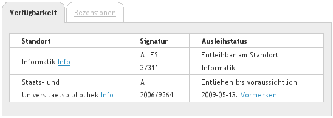

# Introduction

When I started to work at the Verbundzentrale des GBV (VZG), just having
finished my degree in library science and computer science, I was frankly
surprised by the state of programming interfaces to library systems in general
and web services in particular. The best one could find was SRU
(Search/Retrieve via URL), a search API not known outside library IT.  Other
services were hidden, arcane access points with rarely specified
interfaces.^[To be honest one should mention at least the existence of API
specifications for some services, independently from their actual
(non)implementation in library systems at that time: OAI-PMH, RSS, and AtomPub
for syndication; SRU Update for update/edit, OpenID, and Shibboleth for
Authentification; unAPI, COInS, and Microformats to provide data for copy and
paste.] Still I was motivated to replace the inaccessible library IT with a
service oriented architecture (SOA).^[See [@Voss2008] for another API developed
by this motivation at that time.] One part of this strategy was the creation of
a dedicated API to query real-time availability of documents, which is the
topic of this article.^[The authority file record URI for DAIA is
<http://www.wikidata.org/entity/Q17122861>.] The resulting Document
Availability Information API (DAIA) is being used successfully within the
Common Library Network (GBV) and other German library networks since 2009.
This article first introduces the current specification of DAIA as recently
revised to become version 1.0.0 [@DAIA_1.0].  Background of the development is
then covered with the history of DAIA until now.  The final sections summarize
existing applications and implementations and conclude with a biased summary.

# DAIA in a nutshell

In a nutshell the Document Availability Information API defines a method
to query the current availability of documents via HTTP. A **document** must be
identified by an URI but DAIA services may map other forms of request
identifiers to normalized URIs. A DAIA response contains information about
particular **items** which are copies or holdings of documents, so the first
application of DAIA is getting a list of copies held by a library or library
network. This use case can best be illustrated with an example:

Given the Western Michigan University Libraries had a DAIA service at
<https://wmich.edu/library/daia>, a request with ISBN-10 via request URL
<https://wmich.edu/library/daia?id=1490931864&format=json> could result in the
following JSON object (example based on actual library data from their public
catalog):

~~~json
{
  "institution": {
    "id": "http://id.loc.gov/vocabulary/organizations/mikw",
    "href": "https://wmich.edu/library",
    "content": "Western Michigan University Libraries"
  },
  "document": [
    {
      "id": "urn:isbn:9781490931869",
      "requested": "1490931864",
      "item": [ 
        {
          "id": "http://wmich.edu/library/barcode/31141023353605",
          "label": "Z666.7 .V6 2013",
          "department": {
            "content": "Dwight B. Waldo Library"
          }
        }
      ]
    }
  ]
}
~~~

The *request identifier* `1490931864` (`requested`) is mapped to the document
URI `urn:isbn:9781490931869` and found with one item (`item`). The item is
returned with its shelf mark (`label`).  As included in this example, a DAIA
response can also contain information about the holding library (`institution`)
and a particular branch (`department`) which an item is located at.  Use of
URIs to identify entities (`id`) is encouraged, so additional information can
be retrieved as Linked Open Data or via other APIs (for instance
[`http://id.loc.gov/vocabulary/organizations/mikw`](http://id.loc.gov/vocabulary/organizations/mikw)
returns the address of the library).

To ensure automatic processing of DAIA responses, the DAIA specification avoids
free-text fields other than literal names and labels.  This also applies to the
encoding of actual availability, which is not expressed by textual descriptions
such as "currently available" or "on hold".  Availability instead is based on
**services**, being the third important concept next to documents and items.
An item in the DAIA data model is never available or unavailable by itself but
only for a specific service provided by a specific organization.  It is crucial
to note that an item can be available for mutliple services under multiple
conditions. The same item can also be available for one service and unavailable
for another service at the same time.  DAIA specification defines five service
types:

+------------------+-----------------------------------------------------------+
| **presentation** | making an item accessible within the helding organization |
|                  | (e.g. non-lending reference holdings)                     |
+------------------+-----------------------------------------------------------+
| **loan**         | proving an item for lending                               |
|                  | (after picking it up at the library)                      |
+------------------+-----------------------------------------------------------+
| **remote**       | delivery of an item to the patron (e.g. remote access     |
|                  | of digital documents or home delivery of books)           |
+------------------+-----------------------------------------------------------+
| **interloan**    | giving an item to interlibrary loan                       |
+------------------+-----------------------------------------------------------+
| **openaccess**   | providing an URL for unlimited online access              |
+------------------+-----------------------------------------------------------+

  : DAIA service types

The main question to be answered with these service types is what an average
patron can do with a particular item. Developed from a users' perspective DAIA
does not distinguish document types or similar properties of library holdings
that only affect document usage indirectly. A DAIA response rather lists which
types of usages can currently be provided (available) or not provided
(unavailable) with a document instance. The information is encoded in JSON
fields `available` and `unavaibale` of an `item` like this:

~~~json
{
  "available": [ 
    { "service": "presentation" }, 
    { "service": "interloan" } 
  ],
  "unavailable": [ 
    { "service": "loan" }, 
    { "service": "remote" } 
  ]
}
~~~

The item in this example can be used within the library and ordered to another
library via interlibrary loan but it is not lend or remotely given to the
patron. Each service can further be specified with additional fields, covering
virtually all use cases we could find:

* A service can **require some action** to be performed, registered, or
  reserverd (`href`). Examples include ordering a book from the stacks or
  reserving a book which is currently not available.  reserving a book.

* An available service can **come with some delay** (`delay`), for
  instance if a book must be delivered to the reading room.

* An unavailable service can **expected to become available** after
  some estimated time  (field `expected`) and/or after a number of
  reservations (field `queue`).

* A service can be subject to additional **limitations** (`limitation`). The
  DAIA specification contains recommendations of common limitation types such
  as required approval or no interlibrary loan to foreign contries.

The full set of data fields described in the DAIA specification implies a data
model to express common cases of document availability in libraries and related
institutions. How to present this information in a user interface is not
defined by DAIA but depends on the application. The specification suggests a
reduced, flat format named "DAIA Simple" for simple use cases when there is a
preferrence of service types (e.g. openaccess is always better than remote
which is always better than loan which is always better than presentation).
Some applications might further reduce the availability to simple boolean
value. The ng-daia client [@ngdaia, @AngularJS2014] contains some templates
for display of availability information. Nevertheless any decision how to
present availability information for best user experience requires
understanding of both use cases and the DAIA data model.

A full example of a DAIA response covering the information displayed in an
actual discovery interface (Figure 1) is given below. The response contains a
document with two items at the Hamburg State and University Library, one
available at the department of computer scienc and the other being on loan.

~~~json
{
  "institution": {
    "id": "http://uri.gbv.de/organization/isil/DE-18",
    "href": "http://www.sub.uni-hamburg.de",
    "content": "Staats- und Universitätsbibliothek Hamburg Carl von Ossietzky"
  },
  "document": [
    {
      "id": "http://uri.gbv.de/document/opac-de-18:ppn:496539388",
      "href": "http://kataloge.uni-hamburg.de/DB=1/PPNSET?PPN=496539388",
      "item": [
        {
          "id": "http://uri.gbv.de/document/opac-de-18:epn:723843554",
          "department": {
            "content": "Informatik-Bibliothek",
            "href": "http://www.inf.uni-hamburg.de/de/inst/bib.html"
          },
          "label": "A LES 37311",
          "available": [
            { "service": "presentation" },
            { "service": "loan" }
          ]
        },
        {
          "id": "http://uri.gbv.de/document/opac-de-18:epn:798020261",
          "label": "A 2006/9564",
          "unavailable": [
            {
              "service": "presentation", 
              "expected": "2009-05-13",
            },
            {
              "service": "loan",
              "expected": "2009-05-13",
              "href": "https://kataloge.uni-hamburg.de/loan/DB=1/RES?EPN=1581266766&LOGIN=ANONYMOUS"
            }
          ]
        }
      ]
    } 
  ]
}
~~~

# A brief history of DAIA

## Motivation and creation

DAIA originates in the age of Library 2.0 that some readers may remember as a
time of hope and struggle.  Shortcomings of online public access catalogs
(OPAC) and library services had become obvious enough, especially compared to
manifold possibilities of web techonologies, to generate a momentum for change
and experiments.  This allowed the Hamburg State and University Library to get
three years of funding for a project to create a "Catalog 2.0" aka "next
generation catalog". The development of *Project Beluga* and the resulting
discovery interface can be followed in its blog and presentations since
2007.^[See <http://beluga-blog.sub.uni-hamburg.de/> (in German).] The VZG as
service provider of Hamburg University libraries was asked to supply access to
the integrated library system (ILS). Instead of creating a dirty hack we
decided to provide a general web service for clean access to real-time
availability information.  Based on use cases an availability API was
discussed, implemented, and defined by Anne Christensen from Beluga, Uwe Reh
from HeBIS library network, and me.^[HeBIS uses the same LBS ILS as GBV/VZG so
he provided valuable information about its data format and access.  Ironically,
the DAIA server for Hamburg library was implemented and hosted by HeBIS
although the library is a customer of VZG. I take this cooperation as early
lesson that library IT developers can best work together if they are free to
ignore politics.] Existing APIs and standards evaluated during specification of
DAIA included recommendations of the ILS Discovery Interface Task Force and
schema drafts [@Ockerbloom2008], Z39.50 Holdings Attribute Set and Schema
[@Z39_50_Holdings], ISO 20775 Holdings [@Gatenby2008] and the Catalog
Availability Web Service of the NCSU Libraries catalog [@Sierra2007].  The
resulting specification was named DAIA 0.5 [@DAIA_0.5].

## Evangelism and reception

To promote the newly defined API, a lightning talk was given at the European
Library Automation Group (ELAG) conference 2009 [@elag2009]. At the annual
German library conference DAIA was presented [@bibtag2009; @Reh2009] and
recommended to some ILS vendors at the conference fair.  Despite further
efforts in documentation, and publication of an open source reference
implementation [@DAIApm] the interest in DAIA was limited.^[Only later I
realized that technical arguments are mostly irrelevant in the context of
library systems because of an ill-fated relationship between libraries and
library IT vendors.] 

Two exceptions are worth to mention: Ross Singer provided an experimental
implementation for the *OpenBiblio* library system as part of his Jangle
framework [@Singer2008]. Another independent came in 2010 from Markus Fischer
from the libraries of Swiss Solothurn hospitals AG: he implemented a DAIA
service for *[Doctor Doc](http://www.doctor-doc.com)*, a link resolver and
management tool for interlibrary loan. The implementation does not strictly
follow the specification as it uses OpenURL fields (`issn`, `volume`,
`date`...) instead of unique request identifiers to easier meet its use case of
looking up journal articles. Availability information from Doctor-Doc is
included in the VuFind-based article reference database
[bibnet.org](http://bibnet.org) as described by @Fischer2010.

## Adoption and implementation

Most libraries in both library networks HeBIS and VZG use the same ILS, [LBS by
OCLC](http://www.oclc.org/en-europe/lbs.html) (formerly PICA). For this reason
it was possible to reuse the first DAIA server at HeBIS, primarily created for
project Beluga, for other libraries as well. Nevertheless I started to
implement a second server for hosting a central DAIA service at VZG as
technology demonstration (<http://daia.gbv.de/>).  In the following years
development at VZG shifted to specification of ontologies for integration of
DAIA into the Semantic Web so the server was never promoted an official
service.  Nevertheless the prototype, providing a rudimentary DAIA service for
all GBV libraries, attracted some use cases and experiments:

During the first German VuFind Meeting a DAIA driver was created to integrate
DAIA services into VuFind Discovery Interface [@Kinstler2009].  One of the
first applications of this integration was provided by two students in form of
they Bachelor's thesis: The "Bachelopac" by Jörg Schmitt and Marcel Stehle
[-@Schmitt2011; -@Schmitt2010] showed the easy of setting up a discovery
interface for Hamburg University of Applied Sciences (HAW).^[This early history
of VuFind in Germany must not be told without mentioning the "cat library"
<http://www.katzenbibliothek.de>, a VuFind-based bibliography of cat novels
created by  Stephanie Funk as Master's Thesis in 2011.] The DAIA service for
their ILS was provided by Oliver Goldschmidt [-@Goldschmidt2010] who was
experimenting with DAIA and VuFind for the
"[TUBfind](https://katalog.tub.tuhh.de/)" discovery interface of Hamburg
University of Technology (TUHH) around the same time.^[Looking back it is worth
to ask ask why three indenpendent DAIA wrappers had been created as wrapper to
the same type of ILS (LBS). One reason might be the need of local
configuration.  Anyway this work showed it was easy to hack your own DAIA
server.]  Motivated by the ease of this implementations more and more German
libraries and library networks started to use VuFind with DAIA services
mostly provided by the library networks GBV/VZG, HeBIS, and BSZ. 

## Maturity and problems

Despite the success of DAIA as internal tool for connecting VuFind with ILSes
the vision of an open API to availability information was not realized.
Compliance of DAIA services with the specification was difficult to judge and
new applications were unlikely to emerge as only the central DAIA service of VZG
was publically available and documented.

The more this service was used, the less it was possible to modify this early
prototype, so signs of code smell and software rot became undeniable. In
contrast to other implementations the central server was planned as generic
service for a large number of library systems so configuration for each new
library added added more and more complexity. At the same time the service
served as demo and testbed for the specification, which was always marked as
working draft. Especially dropping features was difficult in a running system.
Given that DAIA at VZG was not funded or properly managed, motivation was low
to fully rewrite both specification and implementation by a single developer.

## With PAIA to DAIA 1.0.0

The incentive to eventually finish DAIA 1.0.0 specification came with
implementation of another API for access to patron accounts: the *Patrons
Account Information API (PAIA)* was specified as complement to DAIA during
development of the mobile library application "BibApp" in 2012. Although PAIA
is more complex than DAIA, as it also includes authentification and write
access, the specification turned out to be but easier and cleaner than DAIA
0.5. 

Based on the specification of PAIA [@PAIA], a first PAIA server was
implemented by a contractor^[Creation and maintanance of BibApp is done by the
software company [effective WEBWORK](http://www.effective-webwork.de/) and
paid by all libraries that use BibApp while VZG provides APIs to their library
systems.] as simple wrapper to the library loan system and later replaced by a
second implementation with internal access to the ILS in 2013/2014.  Having a
module to directly access ILS functionality allowed us to think about
replacing the old DAIA server with a more robust implementation. This new
implementation of a DAIA server motivated a major revision of DAIA
specification.

## What's new in DAIA 1.0.0

The difference between DAIA 0.5 and DAIA 1.0.0 follows a different pattern than
second versions of APIs such as OpenURL (from 0.1 to 1.0) and SRU (from 1.2 to
2.0): instead of adding abstraction and complexity, the revision of DAIA
already started with an abstract data model. In anticipation of my PhD thesis
[@Voss2013] DAIA 0.5 was firmly grounded in conceptual modeling with mappings
to multiple data structuring formats such as XML, JSON, and RDF. The support of
these multiple output formats turned out to be complex without real benefit so
XML and RDF were dropped in favour of JSON.  The query parameter `format=json`
keeps backwards compatibility with DAIA 0.5. Explicit mapping of DAIA format to
RDF was also removed but it is still possible and helped to maintain a clear
data model. The lesson learned is data modeling is important to get a data
format but it should not be made explicit in the final product.  The remaining
changes keep backwards-compatibility so a DAIA client expecting DAIA 0.5 JSON
format will still make sense of a DAIA 1.0.0 service.  The revision of DAIA
adds examples and notes and it clarifies some poorly definied cases such as the
exact meaning of service fields `expected` and `href`. Most additional features
are optional or optional features of DAIA 0.5 made mandatory in DAIA 1.0. The
most important practical addition is the introduction of service type "remote"
and recommendations of limitation types to better cover digital documents and
restriction in interlibrary loan. The following lists summarize all removed and
added features.

<!--
- recommended encoding of common limitations of interlibrary loan (e.g. no
  loan to foreign countries): Digital Documents and Interloan is difficult
  because libraries often don’t know what they have licensed under what conditions. 
  A working group at GBV (cite) looked at several licenses and found the 
  following common conditions on interlibrary loan of digital publications:
--->

### Removed features {.unnumbered}

* Response formats XML and RDF in favour of JSON

* Data fields `version`, `schema`, and `message`.
  The latter was intended for error messages but misused
  to sneak through unspecified free-text information

* Useless edge cases such as services without service type
  and empty entities

### Mandatory new features {.unnumbered}

* Query parameter `format` must be set to `json`.

* More specific processing of query parameter `id` with support
  of multiple request identifiers (separated by `|`) and mapping
  to response identifiers (document field `requested`).

* HTTP response headers (`Content-Type`, `X-DAIA-Version`, `Link`)

* Basic integrity rules formalizing common sense

### Recommended new features

* New service type `remote` for remote access. The existing service type
  `presentation` and `loan` were changed to not cover this use case anymore.

* Introduction of limitation types to cover most use-cases in interlibrary loan
  and licenses in open access

* Language of textual data fields should be indicated by HTTP response
  header `Content-Language`.

* Support of HTTP request methods HEAD and OPTIONS

* Support of Cross-Origin Resource Sharing (CORS)

* Support of HTTP request headers `Accept` and `Accept-Language`

* All strings should be normalized to Unicode Normalization Form C (NFC).

### Optional or non-normative new features {.unnumbered}

* Authentification and patron-specific availability

* Field `about` with human-readable description of documents and items

* JSON Schema to validate DAIA response format

* Reference to DAIA Simple format
 

# Applications

## DAIA clients

The major DAIA clients are discovery interfaces based on VuFind. The DAIA
driver in VuFind has been created and improved collaboratively by several
VuFind users. The driver is part of VuFind since version ?? and better support
of DAIA 1.0.0 features is being implemented in VuFind 2.  VuFind instances that
internally make use of DAIA are mainly provided by the German library
consortiums or hosted by for academic libraries:

* Within GBV library network at twelve libraries use VuFind with DAIA.
  ^[<https://www.gbv.de/wikis/cls/VuFind>]

* Nine Hessian libraries use HeBIS Discovery System (HDS)
  ^[<http://www.hebis.de/de/1kataloge/hds.php>]

* The Discovery System BOSS by BSZ covers 31 libraries
  ^[<https://wiki.bsz-bw.de/doku.php?id=projekte:boss:start>]

* Thirteen libraries in Saxonia based consortium finc 
  ^[<https://finc.info/de/nutzergemeinschaft>]\
  **(TODO: was ist der Stand? was macht der Rest des SWB?)**

Other discovery interfaces that make use of DAIA include
["ALBERT"](https://www.kobv.de/services/hosting/albert/) by KOBV and "Lukida"
ba VZG. The KOBV library network uses ALBERT for the [regional library portal
for Berlin and Brandenburg](http://portal.gbv.de/) where availability of six
libraries is integrated via DAIA. Another instance of ALBERT for the Leibniz
Institute for Science and Mathematics Education, Kiel uses DAIA as well. Lukida
is an alternative to VuFind being developed by VZG. Within VZG DAIA is further
used for interlibrary-loan checking for selected libraries. The internal module
is called "MAUS".

A differnt kind of DAIA client is the mobile library application BibApp,
currently used by eleven libraries. The app is Open Source and available for
Android and iOS.^[See <https://www.gbv.de/wikis/cls/BibApp> for a German
overview of BibApp. See <https://github.com/gbv/bibapp-ios> and
<https://github.com/gbv/bibapp-android> for the source code.] Another mobile
application is the "Mobile.UP" by Postdam University.  It covers basic library
search and availability via DAIA, among other features.^[See
<http://www.uni-potsdam.de/mobileup/> for project information and
<https://github.com/University-of-Potsdam-MM/UP.App> for source code.] 

The JavaScript module ng-daia [@ngdaia] for use with the AngularJS framework
has already been presented in code4lib journal [@AngularJS2014]. It can be used
to display availability information via DAIA on arbitrary web pages.

Although DAIA has explicitly been designed as open API, little clients are
known created outside of library applications so far. Promising candidates for
such DAIA clients include learning management systems and reference managers
which both may want to display the current availability and location of
documents.  Maybe more applications will emerge when libraries start to
document and propagate their DAIA services as public APIs instead of only using
them to internally connect their own systems.

software   created by           open source
---------- -------------------- --------------------------
VuFind     community            yes (PHP)
BibApp     effective WEBWORK    yes (Java and Objective-C)
Mobile.UP  University Potsdam   yes (JavaScript)
Lukida     VZG                  yes (PHP)
ng-daia    VZG                  yes (JavaScript)
MAUS       VZG                  no (Java)
---------- -------------------- --------------------------

  : DAIA client software

## DAIA servers

DAIA services have been implemented for several ILS, mainly used in Germany, so
far.  All implementations but one have been created by ILS users instead of
being provided as official APIs by the ISL vendors.

The first DAIA server by HeBIS library network has been replaced by a new
wrapper based on screenscraping to provide available information from *LBS* ILS
systems in [HeBIS Discovery System](http://www.hebis.de/de/1kataloge/hds.php)
(HDS). The central DAIA server of VZG also wraps *LBS* but based on the
internal record format PICA+ and additional config files. This server is being
replaced by a new implementation with direct access to the LBS loan database.
Parts of the central server have been released as Perl modules at CPAN to
facilitate the creation of DAIA\ 0.5 wrappers [@DAIApm; @PlackDAIA].  DAIA
servers for ILS [*Bibliotheca*](https://www.oclc.org/de-DE/bibliotheca.html)
(originally from BOND, now also OCLC) and
[*Libero*](http://www.lib-it.de/produkte/libero.html) from LIB-IT have been
created independently as part of the Saxonian project finc.^[See
<https://finc.info> for project information,
<https://github.com/finc/DaiaTheca> and <https://github.com/finc/DaiaLibero>
for DAIA servers implemented in Java.] The Bibliotheksservice-Zentrum
Baden-Württemberg (BSZ) provides DAIA servers for their customers with ILS
*aDIS/BMS* from [a|S|te|c](https://www.astec.de/) and for *Koha*.^[See
<https://wiki.bsz-bw.de/doku.php?id=l-team:daia:start>] Both are implemented as
closed wrappers not integrated in the ILS, so neither Koha provides a native
DAIA service so far.^[The lack of interest within the Koha community suprised
me, given that the ILS is both Open Source and written in Perl just like the
public reference implementation of DAIA 0.5.] *Doctor-Doc* including its DAIA
server is available as open source.^[The Java source code is located at
<https://sourceforge.net/projects/doctor-doc>.] The only implementation coming
from an ILS vendor is the DAIA module of [*BIBDIA* ILS from BibBer
GmbH](http://www.bibdia.de/bibdia) . The module was created for the City and
State Library of Potsdam to be integrated into the KOBV portal of libraries in
Berlin and Brandenburg.

ILS         ILS vendor DAIA implementer DAIA version open source public access
----------- ---------- ---------------- ------------ ----------- -------------
LBS         OCLC       HeBIS            0.5?         no          no
LBS         OCLC       VZG              0.5          yes (Perl)  yes
LBS         OCLC       VZG              1.0.0        no          yes
Bibliotheca OCLC       finc             0.5?         yes (Java)  no? (TODO)
Libero      LIB-IT     finc             0.5?         yes (Java)  no? (TODO)
aDIS/BMS    a|S|te|c   BSZ              0.5          no          no
Koha        --         BSZ              0.5          no          no
BIBDIA      BiBer      BiBer            0.5          no          no
----------- ---------- ---------------- ------------ ----------- -------------

  : DAIA support for ILS

# Summary and outlook

The Document Availability Information API provides a defined method to query
the current availability of documents via HTTP.  Based on a conceptual model of
documents, items, services, and limitations the API helped to define
availability independent from fuzzy ideas of a "general availability",
free-text fields, and other ILS oddities.  By now there are DAIA services for
six different ILS and more than 60 libraries use the API productively.

Despite this success, the original vision of DAIA is far from fulfilled.

* On a closer look, however, this success is limited and far from the origina
  vision: Most DAIA servers are hidden and none are advertised as public
  service. 

1. DAIA does not come from vendor or if so (BIBDIA) vendor does not advertise 
   DAIA

2. Libraries do not advertise DAIA as public service but only use it internally

*Important criteria: OPEN API by design, public access, no IP or contract
restriction "hackability".*

3. Exising services in production are limited to DAIA 0.5

- International adoption and independent implementations in other
  ILS? (VZG will probably implement DAIA at Kuali OLE but what about
  other sofware). More clients? 

- Make DAIA endpoints more popular also to third parties

- Rule learned: no API implementation without specification, no specification
  without implementation (at least of a client). Sure throw-away prototypes
  are still important but a fresh implementation from scratch is needed once
  the specification has been finished.

- difficulty of digital publications and licenses
  but if we cannot cleanly encode availability information for
  traditional, physical documents, how can be expect to do better
  with digital documents?

- ...

Apart from "openaccess" the service types do not distinguish document types
digital or physical material.

*what: real-time availability information*

- service levels to better descripe properties of a DAIA server (or just 1.0.0)?

Bewertung: SOA is still not wanted or understood.

# References
