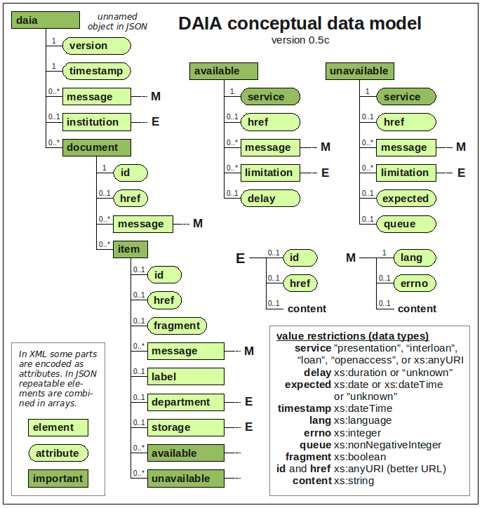

# Introduction

When I started to work at the *Verbundzentrale des GBV* (VZG), just having
finished my degree in library science and computer science, I was frankly
surprised by the state of programming interfaces to library systems in general
and web services in particular. The best one could find was SRU
(Search/Retrieve via URL), a search API not known outside library IT.  Other
services were hidden arcane access points with rarely specified interfaces.
Still I was motivated to replace the inaccessible library IT with a service
oriented architecture (SOA).^[See [@Voss2008] for another API developed by this
motivation at that time.]

...

*...other services had appropriate APIs at least theoretically: 
OAI-PMH, RSS, and AtomPub for Syndication, SRU Update for update/edit,
OpenID, Shibboleth for Authentification, unAPI, COInS, and Microformats
to provide data for copy and paste etc.*

*...DLF ILS Discovery Interface Task Group’s recommendation, existing APIs such
as NCIP...*

# DAIA in a nutshell

*...overview of purpose and specification...*

*what: real-time availability information*

- based on a conceptual data model:
- does avoid the bad habit to put semantics into free-text fields

Main DAIA concepts: documents, items and services

Additional concepts: entities such as holding institutions and storage locations

In contrast to existing library IT APIs DAIA was developed from a a users'
perspective: the basic question which DAIA helps to answer is about document
usage provided by library. Therefore DAIA does not include document types
but service types.

*...[@DAIA]...*

The most important design decision in DAIA: The idea of a "general
availability" status, as shown in some OPACs, was suggested several times but
it was rejected. In DAIA an item is never available or unavailable by itself
but only for a specific service and provided by a specific organization. The
same item can be available for one service and unavailable for another service
at the same time.

question to be answered with DAIA result: what can be done with a document?

...

# A brief history of DAIA

## Motivation and creation

The **Document Availability Information API** originates in the age of Library
2.0 that some readers may remember as a time of hope and struggle.
Shortcomings of online public access catalogs (OPAC) and library services had
become obvious enough, especially compared to manifold possibilities of web
techonologies, to generate a momentum for change and experiments.  This allowed
the Hamburg State and University Library to get three years of funding for a
project to create a "Catalog 2.0". The development of **Project Beluga** and
the resulting discovery interface can be followed in its blog and presentations
since 2007.^[See <http://beluga-blog.sub.uni-hamburg.de/> (in German).] The VZG
as service provider of Hamburg University libraries was asked to supply access
to the integrated library system (ILS).  

**...TODO: screenshot of Beluga from @elag2009**

DAIA web service was created in 2008 to provide clean access to real-time
availability information for the "next generation catalog" developed in
project Beluga. Based on use cases an API was discussed, implemented, and
defined by Anne Christensen from Beluga, Uwe Reh from HeBis library union
network^[HeBis uses the same ILS as GBV/VZG so he provided valuable
information about its data format and access. Ironically, the DAIA server for
Hamburg library was implemented and hosted by HeBis and although the library
is a customer of VZG. I take this cooperation as early lesson that library IT
developers can best work together if they are free to ignore politics.] and
me.

*...Beluga: [@Christensen2010]
<http://nbn-resolving.de/urn/resolver.pl?urn:nbn:de:0290-opus-8394>,
DAIA 0.5: [@DAIA_0.5]...*

## Evangelism and adoption

To promote the newly defined API, a lightning talk was given at the European
Library Automation Group (ELAG) conference 2009 [@elag2009]. At the annual
German library conference DAIA was presented [@bibtag2009] and recommended to
some ILS vendors at the conference fair.  Despite further efforts in
documentation and publication of an open source reference implementation
[@DAIApm] the outcome was limited.^[only later I realized that technical
arguments are mostly fruitless because of an ill-fated relationship between
libraries and library IT vendors.] An early, experimental implementation for
the *OpenBiblio* library system was provided by Ross Singer as part of the
Jangle framework [@Singer2008].  Another independent implementation came from
Markus Fischer from the libraries of Swiss Solothurn hospitals AG: he
implemented a DAIA service for *[Doctor Doc](http://www.doctor-doc.com)*, a
link resolver and management tool for interlibrary loan. The implementation
does not strictly follow the specification as it uses OpenURL fields (`issn`,
`volume`, `date`...) instead of unique request identifiers to easier meet its
use case of looking up journal articles. Availability information from
Doctor-Doc is included in the VuFind-based article reference database
[bibnet.org](http://bibnet.org) as described by @Fischer2010.

*...2010-2012: VuFind, BibApp, libsites (side-project)...*

Over the years the central DAIA server of VZG was used more and more, but
signs of code smelll and software rot became undeniable.

- Prolem: code base directly origined from first prototype,
  implementation and specification being maintained by the same 
  person (me)

- Both server and specification had became too complex to quickly rewrite them
  from scratch. it was difficult the change the implementation without
  touching the main implementation and vice versa.

- Running system: no motivation to revise specification and/or implementation

- multiple output formats: complex without benefit. 

- retrospectively: DAIA tried to put two much data modeling into the
  specification (lesson learned: data modeling is important but should be
  invisible in the final product)

- ...

## With PAIA to DAIA 1.0

The final motivation to eventually finish DAIA 1.0 specification came with
implementation of another API for access to patron accounts: the **Patrons
Account Information API (PAIA)** was specified as complement to DAIA during
development of the mobile library application "BibApp" in 2012.^[See
<https://www.gbv.de/wikis/cls/BibApp> for a German overview of BibApp. The
application is available as Open Source at <https://github.com/gbv/bibapp-ios>
and <https://github.com/gbv/bibapp-android>.] Although PAIA is more complex
than DAIA, as it also includes authentification and write access, the
specification turned out to be but easier and cleaner than DAIA 0.5. 

Based on the specification of PAIA [@PAIA], a first PAIA server was
implemented by a contractor^[Creation and maintanance of BibApp is done by the
software company [effective WEBWORK](http://www.effective-webwork.de/) and
paid by all libraries that use BibApp while VZG provides APIs to their library
systems.] as simple wrapper to the library loan system and later replaced by a
second implementation with internal access to the ILS in 2013/2014.  Having a
module to directly access ILS functionality allowed us to think about
replacing the old DAIA server with a more robust implementation. This new
implementation of a DAIA server motivated a major revision of DAIA
specification.

## What's new in DAIA 1.0

*...comparision of DAIA 0.5 with DAIA 1.0...*

DAIA 0.5 was firmly grounded in conceptual modeling, XML, and RDF etc.
(an anticipation of my thesis but not practical to communicate the API).

- Removal of options that had showed to be unnecessary over the years
  and addition of missing features.

- Maintaining backwards-compatibility as best as possible.

- Main decicision: get rid of XML and RDF (see what Jonathan Rochkind wrote
  before leaving library IT at
  <https://bibwild.wordpress.com/2015/11/23/linked-data-caution/>)
  The Approach to use RDF as basic data format turned out to be impractical but
  it helped conceptual modeling 

- recommended encoding of common limitations of interlibrary loan (e.g. no
  loan to foreign countries): Digital Documents and Interloan is difficult
  because libraries often don’t know what they have licensed under what conditions. 
  A working group at GBV (cite) looked at several licenses and found the 
  following common conditions on interlibrary loan of digital publications:
  
  ...

- recommended encoding of open access licenses

...

# Applications

*...servers, clients, usage...*

## DAIA clients

The first use case and application of DAIA was Beluga...

Unfortunately Beluga was created when VuFind was not available yet, so
the project had to support its own code base.
...

The DAIA driver in VuFind has been created and improved collaboratively by
several VuFind users.

BibApp...

The JavaScript module ng-daia [@ngdaia] for use with the AngularJS framework
has already been presented in code4lib journal [@AngularJS2014].

Within VZG DAIA is also used for interlibrary-loan checking for selected
libraries.

KOBV...

...

No public use known so far (e.g. display in learning management systems or
reference managers) - one reason might be a lacking proactive publication of
the API by libraries

## DAIA servers

DAIA services have been implemented for several ILS so far. The supported ILS
are mainly used in Germany. All implementations have been created by ILS users
instead of being provided as official APIs by the ISL vendors.

The first DAIA server at VZG, wrapping the **LBS** ILS from OCLC (formerly from
PICA),^[<http://www.oclc.org/en-europe/lbs.html>] is being replaced by a new
implementation with direct access to the LBS database.  Parts of the first
server have been released as Perl modules at CPAN to facilitate the creation of
DAIA\ 0.5 wrappers [@DAIApm,@PlackDAIA].  DAIA servers for ILS **Bibliotheca**
(originally from BOND, now also
OCLC)^[<https://www.oclc.org/de-DE/bibliotheca.html>] and **Libero** from
LIB-IT^[<http://www.lib-it.de/produkte/libero.html>] have been created
independently as part of the Saxonian project finc.^[See <https://finc.info>
for project information, <https://github.com/finc/DaiaTheca> and
<https://github.com/finc/DaiaLibero> for DAIA servers implemented in Java.] The
Bibliotheksservice-Zentrum Baden-Württemberg (BSZ) provides DAIA servers for
their customers with ILS **aDIS/BMS** from a|S|te|c^[<https://www.astec.de/>]
and for **Koha**.^[See <https://wiki.bsz-bw.de/doku.php?id=l-team:daia:start>]
Both are implemented as closed wrappers not integrated in the ILS, so neither
Koha provides a native DAIA service so far.^[The lack of interest within the
Koha community suprised me, given that the ILS is both Open Source and written
in Perl just like the public reference implementation of DAIA 0.5.]
**Doctor-Doc** including its DAIA server is available as open source.^[The Java
source code is located at <https://sourceforge.net/projects/doctor-doc>.] The
final DAIA implementation was created for the **BIBDIA** ILS from BibBer
GmbH^[<http://www.bibdia.de/bibdia>] to be included in the KOBV portal of
libraries in Berlin and Brandenburg.

# Summary and outlook

...

- International adoption and independent implementations in other
  ILS? (VZG will probably implement DAIA at Kuali OLE but what about
  other sofware). More clients? 

- Make DAIA endpoints more popular also to third parties

- service levels to better descripe properties of a DAIA server (or just 1.0)?

- Rule learned: no API implementation without specification, no specification
  without implementation (at least of a client). Sure throw-away prototypes
  are still important but a fresh implementation from scratch is needed once
  the specification has been finished.

- difficulty of digital publications and licenses
  but if we cannot cleanly encode availability information for
  traditional, physical documents, how can be expect to do better
  with digital documents?

- ...

# References
